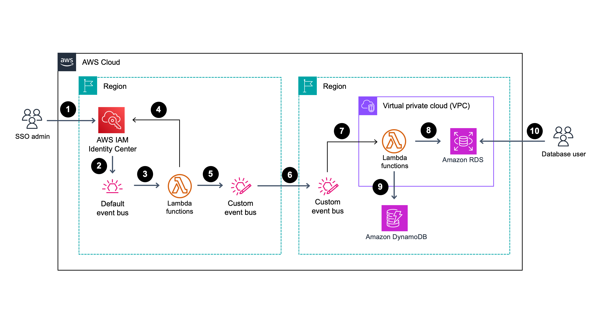

# Welcome to SSO sync to Amazon RDS project

This solution syncs SSO users from AWS IAM Identity Center to Amazon RDS databases.

Supported database engines:
* PostgreSQL
* MySQL

It leverages IAM authentication in RDS to enable users to connect to the database with AWS credentials.

## How it works

The solution includes AWS Cloud Development Kit (CDK) stacks and code for AWS Lambda functions. In general, RDS databases aren't usually deployed in the same AWS account and region as IAM Identity Center. Therefore this solution focuses on a multi-account and/or multi-region deployment. To support it, CDK includes 3 stacks:

1. `EventBridgeSSOLambda` - deployed to the AWS account with access to IAM Identity Center. It includes Amazon EventBridge rules that listen to create and delete user events. The rules trigger corresponding Lambda functions, that enrich the event with additional information (such as username and group name), delete unnecessary details from the event, and forward the modified event to a custom EventBridge bus. The custom bus forwards all events to the target EventBridge bus in the RDS account.
2. `EventBridgeLambdaRDS` - deployed to the AWS account with the target RDS database. It includes custom EventBridge bus that listens to the events emitted by the `EventBridgeSSOLambda` stack, and triggers corresponding Lambda functions. The functions create or delete users in the target RDS database, and track record of the created users in the Amazon DynamoDB table
3. `Outputs` - deployed to the AWS account with the target RDS database. This solution doesn't create or modify RDS databases. This stack is responsible for retrieving necessary details about the existing resources like database endpoint, engine, port, VPC details and more. It helps users specify minimal necessary information instead of retrieving it manually. `EventBridgeLambdaRDS` depends on the `Outputs` stack.



1. SSO administrator creates a new user in AWS IAM Identity Center 
2. AWS IAM Identity Center emits an event to Amazon EventBridge default event bus
3. Amazon EventBridge triggers the AWS Lambda function if user belongs to the configured DBA group
4. The Lambda function retrieves username from the AWS IAM Identity Center
5. The Lambda function emits a new event containing username to a custom EventBridge event bus
6. The custom bus forwards all event to the target AWS account's event bus
7. The custom event bus in the target account triggers the Lambda function
8. The Lambda function in the target account creates user in the Amazon RDS database
9. The Lambda function in the target account stores user mapping in the Amazon DynamoDB table
10. The user can now login to the database using their temporary AWS credentials

EventBridge rules trigger events for a specific group configured in the `IAM_IDC_GROUP_NAMES` variable, e.g. DBA group. You can specify multiple comma-separated group names, for example `"IAM_IDC_GROUP_NAMES": "DBA,Analytics"`. 

The implementation relies on the group name matching database (MySQL or PostgreSQL) role names, which have to be created manually.

Example for MySQL:

```
CREATE ROLE DBA;
GRANT ALL ON test.* TO DBA;
```

Example for PostgreSQL:

```
CREATE ROLE "DBA";
GRANT ALL ON table_x TO DBA;
```

When user is deleted from IAM Identity Center, there's no group membership information present in the event, therefore the Lambda functions record user ID to username mappings in a DynamoDB table. The Lambda functions get username from this table on the `DeleteUser` event. There are 3 event names configured in the EventBridge rules:

* `AddMemberToGroup`
* `RemoveMemberFromGroup`
* `DeleteUser`

EventBridge rules do not match `CreateUser` events, since user creation is covered by the `AddMemberToGroup` event.

The solution doesn't delete or create users if a user with the same username already exists in the database, but is not managed by the solution (i.e. the user ID is not recorded in the DynamoDB table). Membersip in multiple groups is not supported for a single user: when deleting user from one group, it will be deleted from the database regardless of how many groups are assigned to this user.

## Requirements

### On your AWS account side

1. Amazon RDS cluster must be configured with the IAM Authentication: https://docs.aws.amazon.com/AmazonRDS/latest/UserGuide/UsingWithRDS.IAMDBAuth.html
2. Amazon RDS cluster must have a username for the Lambda function. This user should have permissions to create users and grant permissions
3. IAM Identity Center must be configured with a permission set that allows new users to connect to the RDS cluster using their username. Lambda Function will create user regardless of this permission, however the user will fail to authenticate unless it's present. You can find an example policy in `policies/iam-idc-allow-rds-connect.json`
4. When using the example policy, IAM Identity Center must be configured with the following attributes for access control: `key: name`, `value: ${path:username}`. More on that here: https://docs.aws.amazon.com/singlesignon/latest/userguide/configure-abac.html

### On the workstation side

A simple way to satisfy most of the requirements for the workstation is to run the deployment process in AWS Cloud9. You can find out more about it here: https://docs.aws.amazon.com/cloud9/latest/user-guide/welcome.html

1. Make sure you have CDK installed and configured. More on that here: https://docs.aws.amazon.com/cdk/v2/guide/getting_started.html#getting_started_install
2. Make sure docker is up and running. Docker is needed to provision Lambda functions. You can install docker following the official guide here: https://docs.docker.com/engine/install/
3. Install CDK dependencies by running `npm install`

## Configuration variables

The `cdk.json` file tells the CDK Toolkit how to execute your app. It is preconfigured with `dev` context:

```
    "dev": {
      "RDS_ACCOUNT_ID": "123456789012",
      "RDS_REGION": "us-west-1",
      "IDC_ACCOUNT_ID": "012123456789",
      "IDC_REGION": "us-east-1",
      "RDS_CLUSTER_ID": "database-1",
      "RDS_DB_USER": "sso_provisioner",
      "IAM_IDC_GROUP_NAMES": "DBA",
      "NOTIFICATION_EMAIL": null
    }
```

* `RDS_ACCOUNT_ID` and `RDS_REGION_ID` configure the environment and permissions needed to deploy resources in the RDS account. 
* `RDS_CLUSTER_ID` is used to identify the database and retrieve necessary details about it, and `RDS_DB_USER` is the user for Lambda function to connect to the database and run create/drop user queries. 
* `IAM_IDC_GROUP_NAMES` is as comma-separated list of group names. It is used to filter out user groups that need access to the database.
* `IDC_ACCOUNT_ID` and `IDC_REGION` configure the environment and permissions needed to deploy resources in the IAM Identity Center account.

You can configure notifications using `NOTIFICATION_EMAIL` variable (`null` means notifications are disabled). When specified, AWS CDK provisions an additional Lambda function and an Amazon SNS topic with the subscription to a specified e-mail address in a separate AWS CDK stack. If the user provisioning fails, Lambda sends the failure details using Lambda destinations. For the e-mail notifications to work, you have to confirm subscription to the Amazon SNS topic.

## Configuring administrative user for Lambda function
To succesfully assign MySQL roles, the user specified in the `RDS_DB_USER` variable must either be configured with the roles it needs to be able to assign and `WITH ADMIN OPTION`, or it has to be assigned a superuser role. For example:

```
CREATE USER sso_provisioner IDENTIFIED WITH AWSAuthenticationPlugin AS 'RDS';
GRANT 'rds_superuser_role' TO sso_provisioner;
SET DEFAULT ROLE ALL TO sso_provisioner;
```

Similar applies to PostgreSQL:

```
CREATE USER sso_provisioner;
GRANT rds_iam TO sso_provisioner;
GRANT rds_superuser TO sso_provisioner;
```

You can limit the permissions of the user according to the principle of the least privilege and based on your specific use case.

## Deploying and destroying stacks

The first step is to deploy the solution in the AWS account where you run the RDS cluster. To deploy it run:

`cdk deploy EventBridgeLambdaRDS`

In addition to `EventBridgeLambdaRDS` it deploys the `Outputs` stack to the same AWS account. This stack is needed to avoid populating necessary variables manually.

If you get an error saying `SSM parameter not available`, deploy the `Outputs` stack manually:

`cdk deploy Outputs`

The second step is to deploy the solution in the AWS account where you configured IAM Identity Center. This step can be performed independently from a separate workstation. To deploy it run:

`cdk deploy EventBridgeSSOLambda`

When deploying stacks to different accounts, it might be convinient to make use of profiles that are associated with respective credentials. For example, you can configure access to the AWS account where the IAM Identity Center is configured in a profile named `idc-Admin`, and then run the stack specifying this profile:

`cdk deploy EventBridgeSSOLambda --profile idc-Admin`

To rollback the changes, run `cdk destroy` for all the stacks you've deployed. For example:

`cdk destroy EventBridgeLambdaRDS`

`cdk destroy EventBridgeSSOLambda`

## Example logging in (MySQL)

When a new DBA user is created in a SSO identity provider, it will be able to authenticate in the RDS cluster given the pre-requisites are satisfied. They can use `aws` cli in combination with standard `mysql` client in order to login. 

1. Set up your environment with SSO (one-time process):
    ```
    aws configure sso
    ```
    You will need to specify the default region, SSO start URL and other parameters. After that, you will be able to log in using IAM Identity Center.
2. Log in using sso credentials:
    ```
    aws sso login
    ```
    This will redirect you to a webpage where you can enter your SSO credentials and allow access from CLI
3. Retrieve token for IAM authentication with RDS using your SSO username:
    ```
    TOKEN="$(aws --profile {sso_profile_name} rds generate-db-auth-token --hostname {rds_endpoint} --port 3306 --username {username})"
    ```
    Replace `sso_profile_name`, `rds_endpoint`, `username` and if needed `port` with the correct values.
4. Download the latest certificate for RDS (one-time procedure):
    ```
    wget https://truststore.pki.rds.amazonaws.com/global/global-bundle.pem
    ```
5. Log in using `mysql` client:
    ```
    mysql -h {rds_endpoint} -u {username} --password="$TOKEN" --port=3306 --ssl-ca=global-bundle.pem
    ```
    Replace `rds_endpoint` and `username` with the respective values.

## Example logging in (PostgreSQL)

When a new DBA user is created in a SSO identity provider, it will be able to authenticate in the RDS cluster given the pre-requisites are satisfied. They can use `aws` cli in combination with standard `psql` client in order to login. 

1. Set up your environment with SSO (one-time process):
    ```
    aws configure sso
    ```
    You will need to specify the default region, SSO start URL and other parameters. After that, you will be able to log in using IAM Identity Center.
2. Log in using sso credentials:
    ```
    aws sso login
    ```
    This will redirect you to a webpage where you can enter your SSO credentials and allow access from CLI
3. Download the latest certificate for RDS (one-time procedure):
    ```
    wget https://truststore.pki.rds.amazonaws.com/global/global-bundle.pem
    ```
4. Generate PGPASSWORD for IAM authentication with RDS using your SSO username:
    ```
    export PGPASSWORD="$(aws --profile {sso_profile_name} rds generate-db-auth-token --hostname {rds_endpoint} --port 5432 --username {username})"
    ```
    Replace `sso_profile_name`, `rds_endpoint`, `username` and if needed `port` with the correct values.
5. Log in using `psql` client and temporary access credentials:
    ```
    psql "host={rds_endpoint} port=5432 sslmode=verify-ca sslrootcert=global-bundle.pem dbname={db_name} user={username}"
    ```
    Replace `rds_endpoint`, `db_name` and `username` with the respective values.

## Useful commands

* `npm run build`       compile typescript to js
* `npm run watch`       watch for changes and compile
* `cdk deploy`          deploy this stack to your AWS account
* `cdk diff`            compare deployed stack with current state
* `cdk synth`           emits the synthesized CloudFormation template
* `cdk destroy`         deletes this stack from your AWS account
* `cdk ls`              lists available stacks
* `cdk context --reset` resets CDK context with cached variables
