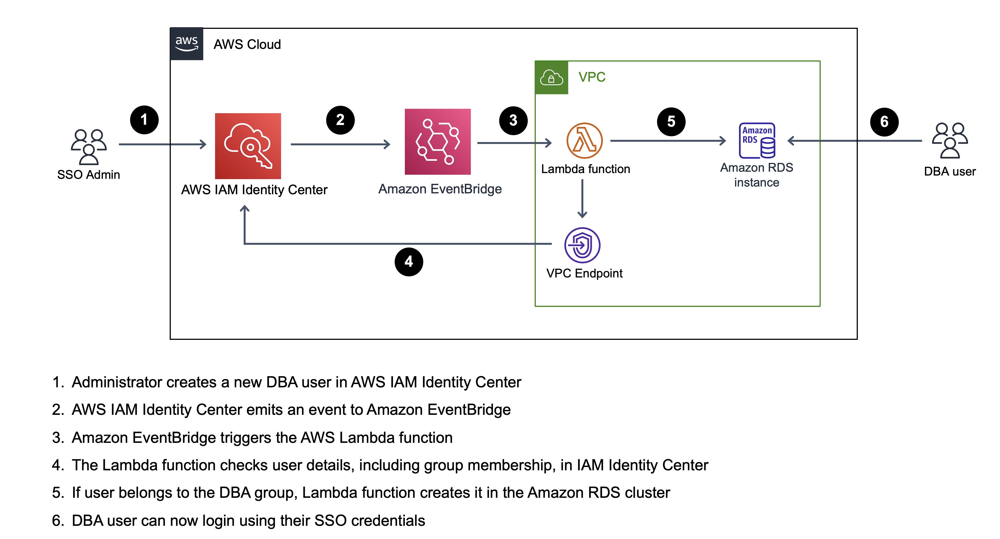

# Welcome to SSO sync to Amazon RDS project

This project sets up AWS Lambda functions, Amazon EventBridge rule, Amazon VPC Endpoint for AWS IAM Identity Center (successor to AWS Single Sign-On), the related Security Groups and permissions necessary to automatically provision database users to the Amazon Relational Database Service (Amazon RDS) cluster using AWS Cloud Development Kit (AWS CDK).


When a new user is created in IAM Identity Center, EventBridge rule will trigger the Lambda function to check the user's group membership. If the user belongs to the group specified in a `IAM_IDC_GROUP_NAME` variable, e.g. DBA group, the Lambda function will create a new user in a specified Amazon RDS cluster. The user will then be able to login to the database using their SSO username and IAM credentials.



## Requirements

1. Amazon RDS cluster must be configured with the IAM Authentication: https://docs.aws.amazon.com/AmazonRDS/latest/UserGuide/UsingWithRDS.IAMDBAuth.html
2. Amazon RDS cluster must have a username for the Lambda function. This user should have permissions to create users and grant permissions
3. IAM Identity Center must be configured with a permission set that allows new users to connect to the RDS cluster using their username. Lambda Function will create user regardless of this permission, however the user will fail to authenticate unless it's present. You can find an example policy in `policies/iam-idc-allow-rds-connect.json`
4. When using the example policy, IAM Identity Center must be configured with the following attributes for access control: `key: name`, `value: ${path:username}`. More on that here: https://docs.aws.amazon.com/singlesignon/latest/userguide/configure-abac.html

## Environment variables

AWS CDK uses the following variables:

```
CDK_DEFAULT_ACCOUNT
CDK_DEFAULT_REGION
CDK_ENV
```

Set these variables before running cdk deployments, for example:

```
export CDK_DEFAULT_REGION=us-east-1
export CDK_DEFAULT_ACCOUNT=123456789123
export CDK_ENV=dev
```

## Configuration variables

The `cdk.json` file tells the CDK Toolkit how to execute your app. It is preconfigured with `dev` context:

```
    "dev": {
      "IAM_IDC_GROUP_NAME": "DBA",
      "IAM_IDC_STORE_ID": null,
      "VPC_ID": "vpc-123bcde20",
      "RDS_DB_NAME": "test",
      "RDS_DB_USER": "sso_provisioner",
      "RDS_CLUSTER_ID": "database-1",
      "RDS_ACCOUNT_ID": null,
      "NOTIFICATION_EMAIL": null
    }
```

`IAM_IDC_STORE_ID` and `RDS_ACCOUNT_ID` are optional. `CDK_DEFAULT_REGION` (from env) is used if not specified, and IAM Identity Store ID is derived dynamically, since there can only be one Store in an AWS Account.

You can configure notifications using `NOTIFICATION_EMAIL` variable (`null` means notifications are disabled). When specified, AWS CDK provisions an additional Lambda function and an Amazon SNS topic with the subscription to a specified e-mail address in a separate AWS CDK stack. If the user provisioning fails, Lambda sends the failure details using Lambda destinations. For the e-mail notifications to work, you have to confirm subscription to the Amazon SNS topic.

## Deploying and destroying stacks

To deploy stacks run:

`cdk deploy --all`

To destroy stacks run:

`cdk destroy --all`

## Example logging in

When a new DBA user is created in a SSO identity provider, it will be able to authenticate in the RDS cluster given the pre-requisites are satisfied. They can use `aws` cli in combination with standard `mysql` client in order to login. 

1. Set up your environment with SSO (one-time process):
    ```
    aws configure sso
    ```
    You will need to specify the default region, SSO start URL and other parameters. After that, you will be able to log in using IAM Identity Center.
2. Log in using sso credentials:
    ```
    aws sso login
    ```
    This will redirect you to a webpage where you can enter your SSO credentials and allow access from CLI
3. Retrieve token for IAM authentication with RDS using your SSO username:
    ```
    TOKEN="$(aws --profile {sso_profile_name} rds generate-db-auth-token --hostname {rds_endpoint} --port 3306 --username {username})"
    ```
    Replace `sso_profile_name`, `rds_endpoint`, `username` and if needed `port` with the correct values.
4. Download the latest certificate for RDS (one-time procedure):
    ```
    wget https://s3.amazonaws.com/rds-downloads/rds-ca-2019-root.pem
    ```
5. Log in using `mysql` client:
    ```
    mysql -h {rds_endpoint} -u {username} --password="$TOKEN" --port=3306 --ssl-ca=rds-ca-2019-root.pem
    ```
    Replace `rds_endpoint` and `username` with the respective values.

## Useful commands

* `npm run build`   compile typescript to js
* `npm run watch`   watch for changes and compile
* `cdk deploy`      deploy this stack to your AWS account
* `cdk diff`        compare deployed stack with current state
* `cdk synth`       emits the synthesized CloudFormation template
* `cdk destroy`     deletes this stack from your AWS account
